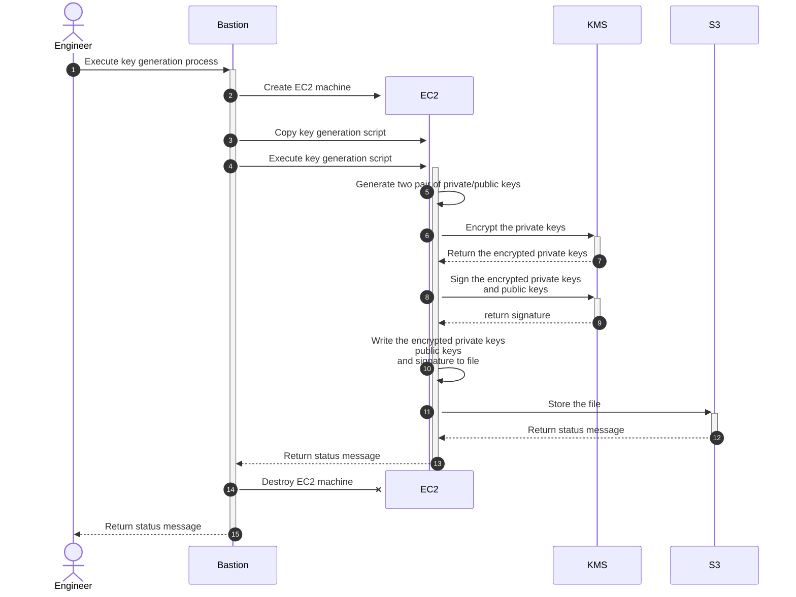

# Keygen

- Generates 2 keypairs: Signing Keypair & Encryption Keypair
- Each keypair's private key is **encrypted using AES256-GCM**
- Each keypair is **signed using Asymmetric P256 key**

## Table of Contents

- [Format](#format)
- [How to Run](#how-to-run)
- [How to Test](#how-to-test)
- [Adding a New Key Service](#adding-a-new-key-service)
- [Environment Variables](#environment-variables)

## Format

```bash
key-pairs.json
├──── signerKey  : <JWT>
│                  ├ ─ ─ <header>
│                  │     └ ─ ─ alg: "ES256"
│                  ├ ─ ─ <payload>
│                  │     ├ ─ ─ privateKey: <AES-256-GCM-Encrypted PEM>
│                  │     └ ─ ─ publicKey
│                  │           ├ ─ ─ x: <x-coordinate>
│                  │           └ ─ ─ y: <y-coordinate>
│                  └ ─ ─ <signature>: <JWS signed by P256 Key>
│
└──── encryptKey : <JWT>
                   ├ ─ ─ <header>
                   │     └ ─ ─ alg: "ES256"
                   ├ ─ ─ <payload>
                   │     ├ ─ ─ privateKey: <AES-256-GCM-KMS-Encrypted PEM>
                   │     └ ─ ─ publicKey
                   │           ├ ─ ─ x: <x-coordinate>
                   │           └ ─ ─ y: <y-coordinate>
                   └ ─ ─ <signature>: <JWS signed by P256 Key>
```

```bash
public-keys.json
├──── [0] ServiceSigningPubK    : Public key used by zkpass service to SIGN PAYLOADS
├──── [1] ServiceEncryptionPubK : Public key used by zkpass service to ENCRYPT PAYLOADS
└──── [2] VerifyingPubK         : Public key used to VERIFY zkpass KEYS
```

## How to Run

1. Clone repository

2. Install Dependencies

```bash
npm install
```

3. Copy & setup `.env`

```bash
cp .env.example .env
```

4. Run script

```bash
npm start
```

## How to Test

Note: It would be easier to set `KEY_SERVICE` as `NATIVE` for testing

```bash
npm test
```

## Adding a New Key Service

To add a new service into the JavaScript repository, follow the steps below:

### 1. Create a New Directory

- Create a new directory in the root folder of the repository. Name the directory appropriately to reflect the new service.

### 2. Prepare Classes

Within the newly created directory, prepare four classes with the following interface:

- [Generator](./interfaces/generator.interface.ts)
- [Cryptor](./interfaces/cryptor.interface.ts)
- [Signer](./interfaces/signer.interface.ts)

- Note
  - Read more about [`JWTVerifyResult`](https://github.com/panva/jose/blob/main/src/types.d.ts#L601)

### 3. Add Classes to `bundle.js`

- Add the newly created classes into the `bundle.js` file's `OPERATION_BUNDLE` mapping.

### 4. Update `.env` File

- Add a new key-value pair in the `.env` file:
  - `KEY_SERVICE`: Set the value to the same mapping key name used in `bundle.js`.

## Environment Variables

1. `KEY_SERVICE`:

- Required: **Yes**
- Description: Specifies the service used for key generation.
- Options:
  - `KMS`: Leveraging AWS Key Management Service (KMS) for asynchronous key generation.
  - `NATIVE`: Zero-dependency, local, synchronous key generation service.

2. `OUTPUT`:

- Required: **Yes**
- Description: File path for the output of generated keys.
- Where to set: Specify the desired file path where you want the output JSON containing the generated keys to be saved.

3. `AWS_KMS_ACCESS_KEY_ID`:

- Required: Only when `KEY_SERVICE` is set to `KMS`
- Description: The Access Key ID used for accessing AWS services.
- Where to get: Generated from the AWS IAM console when creating an Access Key for your IAM user.

4. `AWS_KMS_SECRET_ACCESS_KEY`:

- Required: Only when `KEY_SERVICE` is set to `KMS`
- Description: The Secret Access Key corresponding to the Access Key ID, used for AWS authentication.
- Where to get: Generated along with the Access Key ID in the AWS IAM console.

5. `AWS_KMS_ENCRYPT_KEY_ID`:

- Required: Only when `KEY_SERVICE` is set to `KMS`
- Description: Unique identifier for the encryption key.
- Where to get: Generated when creating a Customer-Managed Key in KMS Service.
- Note: Make sure the generated key is a **Symmetric Encryption-Decryption Key**

6. `AWS_KMS_SIGN_KEY_ID`:

- Required: Only when `KEY_SERVICE` is set to `KMS`
- Description: Unique identifier for the signing key.
- Where to get: Generated when creating a Customer-Managed Key in KMS Service.
- Note: Make sure the generated key is an **Asymmetric Signing-Verifying Key**

7. `AWS_KMS_REGION`:

- Required: Only when `KEY_SERVICE` is set to `KMS`
- Description: The AWS region where the services are hosted.
- Where to get: Specified based on the AWS region where your KMS keys are deployed.


